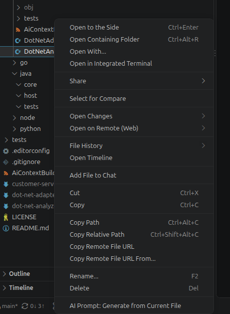

<div align="center">

# 🧠 AI Context Builder & AI Prompt Generator (`aicontext`)

**Generate portable, dependency-aware, AI-ready prompts and code context from any repository.**

[](https://github.com/aicontext/ai-context-builder/actions)
[](https://dotnet.microsoft.com/)
[](https://learn.microsoft.com/en-us/dotnet/csharp/)
[](https://github.com/dotnet/roslyn)
[](https://nodejs.org/)
[](https://www.typescriptlang.org/)
[](https://www.python.org/)
[](#-security--privacy-guarantee)
[](LICENSE)

*A developer selects a file or symbol. AI Context Builder analyzes the source, discovers direct and transitive dependencies across multiple languages, links framework companion files, applies deterministic token and comment policies, and generates exactly one authoritative Markdown document with complete, untruncated source files.*

[Key Principles](#-product-principles) • [VS Code Extension](#-vs-code-extension-guide) • [CLI Quickstart](#-cli-quickstart) • [Architecture](#-architecture) • [Testing & Debugging](#-testing--debugging)

</div>

---

## 🚀 Why AI Context Builder?

When feeding code to LLMs (Claude, GPT, Gemini, DeepSeek) for refactoring, debugging, architecture reviews, or migrations, standard approaches fail:
- **Copy-pasting individual files** leaves out essential interfaces, models, and constructor dependencies.
- **Dumping entire repositories** blows through context limits and confuses the model with irrelevant noise.
- **Naive AI summarization tools** truncate methods, replace real code with ellipses (`// ...rest unchanged`), and strip critical implementation details.

**AI Context Builder solves this:**
- 🛡️ **Complete Source Files**: Every included file is included in full. Never summarized, truncated, pseudo-coded, or replaced with ellipses.
- 📁 **Preserve Original Relative Paths**: Relative workspace paths (e.g. `src/Application/Customers/CustomerService.cs`) are preserved verbatim. Absolute paths are never exposed.
- 📄 **One Output Artifact**: The entire dependency-aware context lives in exactly one self-contained, beautifully formatted Markdown document (`*-context.md`).
- ⚖️ **No Hidden Limits**: When no token budget is specified, all eligible transitive dependencies are traversed without artificial depth or file-count caps.
- 🔒 **100% Local & Private**: Runs strictly locally. No source code upload, no external API keys required, and zero telemetry.

---

## 🧩 Architecture

```text
Visual Studio Code Extension / Visual Studio VSIX / CI / CLI
                             |
                             v
               Context Orchestrator CLI (`aicontext`)
                             |
             +---------------+---------------+
             |                               |
        Shared Core (.NET 10):          Workers (Language-Neutral Protocol):
        - Neutral Dependency Graph       - In-Process .NET Worker (C#, VB.NET, Razor, Blazor, Roslyn)
        - Upward Workspace Discovery     - Node.js Worker (TypeScript Compiler API 5.9, React, Angular, Vue, HTML, SCSS)
        - Deterministic Scoring Engine   - Python Worker (AST, tokenize, import analysis)
        - Token Budget Selector          - Java & Go Analyzers (Project metadata & syntax)
        - Secret Preflight Scanner
        - Safe Markdown Generator
```

The orchestrator is implemented in **.NET 10 / C#** for instant native CLI execution and in-process **Roslyn** semantic analysis, while dedicated workers communicate via standard I/O using a versioned JSON protocol (`protocolVersion: "1.0"`).

---

## 🌐 Supported Languages & Capability Matrix

Every analyzer explicitly discloses its capability level in the generated Markdown metadata:

| Language / File Type | Extensions | Engine / Worker | Capability Level |
| :--- | :--- | :--- | :--- |
| **C#** | `.cs` | .NET Roslyn (`Microsoft.CodeAnalysis.CSharp`) | **Semantic** |
| **Visual Basic .NET** | `.vb` | .NET Roslyn (`Microsoft.CodeAnalysis.VisualBasic`) | **Semantic** |
| **ASP.NET Core** | `.cs` | Controller, Minimal API & DI Enhancer | **Semantic** |
| **Blazor & Razor** | `.razor`, `.cshtml` | Scoped CSS & Companion Code-Behind Enhancer | **SyntaxAware + CompanionFile** |
| **TypeScript** | `.ts`, `.mts`, `.cts` | TypeScript Compiler API 5.9.3 | **Semantic** |
| **JavaScript** | `.js`, `.mjs`, `.cjs` | TypeScript Compiler API 5.9.3 | **Semantic** |
| **React** | `.jsx`, `.tsx` | React Component, Hook & Context Enhancer | **Semantic + SyntaxAware** |
| **Angular** | `.ts`, `.html`, `.scss` | Angular `@Component`, `templateUrl`, `styleUrls` | **Semantic + CompanionFile** |
| **Vue SFC** | `.vue` | Single-File Component Parser (single file in output) | **SyntaxAware** |
| **HTML** | `.html`, `.htm` | HTML Syntax Analyzer (scripts, module scripts, styles) | **SyntaxAware** |
| **CSS, SCSS, Sass** | `.css`, `.scss`, `.sass` | SCSS & Sass Syntax Parser (`@import`, `@use`, partials) | **SyntaxAware** |
| **Python** | `.py` | Python 3 `ast` & `tokenize` Worker | **Semantic** |
| **Java** | `.java` | Java Syntax & Maven/Gradle Project Analyzer | **SyntaxAware** |
| **Go** | `.go` | Go Packages & `go.mod` Syntax Analyzer | **SyntaxAware** |
| **JSON / YAML Config**| `.json`, `.yaml`, `.yml`| Explicitly Referenced Configuration Analyzer | **ImportGraph** |

---

## 💻 CLI Quickstart

### Build the Solution

```bash
dotnet build
```

The compiled CLI wrapper is located at `./bin/aicontext`.

### Usage Examples

```bash
# 1. Analyze C# Service with unlimited token budget
./bin/aicontext generate --file src/Application/Customers/CustomerService.cs

# 2. Analyze Angular Component with HTML template and SCSS partials
./bin/aicontext generate --file src/app/customers/customer.component.ts --framework angular

# 3. Analyze React Component with a 64k token budget and auto comment stripping
./bin/aicontext generate --file src/components/CustomerPage.tsx --max-tokens 64000 --comments auto

# 4. Analyze Python module and output machine-readable JSON metadata
./bin/aicontext generate --file app/services/customer_service.py --format json

# 5. Check active language workers
./bin/aicontext check-workers
```

### Options Reference

```text
Usage:
  aicontext generate --file <path> [options]
  aicontext check-workers

Required:
  --file <path>                  Target source file to analyze

Options:
  --workspace <path>             Workspace root directory boundary
  --project <path>               Explicit project file (.csproj, tsconfig.json, etc.)
  --symbol <qualified-name>      Specific class, function, or symbol to select as root
  --output <path>                Destination Markdown file path
  --max-tokens <int>             Token budget (omitted means unlimited)
  --max-depth <int>              Maximum dependency traversal depth (omitted means unlimited)
  --comments preserve|remove|auto Comment preservation policy (default: preserve)
  --language <lang>              Force specific language analyzer
  --framework <fw>               Force specific framework adapter
  --analysis-level <level>       Best, Semantic, SyntaxAware, ImportGraph
  --task <text>                  Custom prompt task heading
  --include-tests <bool>         Include test files (default: false)
  --include-generated <bool>     Include generated files (default: false)
  --include-attributes <bool>    Include attributes/decorators (default: false)
  --include-companions <bool>    Include companion templates/styles (default: true)
  --include-config <bool>        Include configuration files (default: true)
  --save <bool>                  Write result to file (default: true)
  --copy <bool>                  Copy result to clipboard (default: false)
  --format text|json             Output format (default: text)
  --omit-timestamp               Omit generation timestamp for deterministic golden testing
  --verbose                      Enable verbose diagnostic logging
  --help                         Display help message
  --version                      Display version information
```

---

## 🔌 VS Code Extension Guide

Generate clean, dependency-aware AI prompts directly inside your editor with single-click ease.

<p align="center">
  
</p>

### How to Use

#### 1. Right-Click in the File Explorer (Fastest)
* Right-click any source file in the Explorer tree (`.cs`, `.ts`, `.tsx`, `.razor`, `.py`, `.java`, `.go`, etc.).
* Click **AI Prompt: Generate from Current File**.
* The extension automatically traverses direct and transitive dependencies, links companion templates/styles, strips internal noise, and opens the clean prompt in a new editor tab ready to copy into your AI chat.

#### 2. Right-Click Inside Code (Targeted Symbol)
* Place your cursor on any class name, interface, method, or function.
* Right-click and choose **AI Prompt: Generate from Symbol at Cursor**.
* Generates a focused prompt centered on that specific symbol and its required dependency tree.

#### 3. Command Palette (`Ctrl+Shift+P` / `Cmd+Shift+P`)
* Press `Ctrl+Shift+P` and type `AI Prompt` to see all available actions.
* Choose **AI Prompt: Generate with Options...** to open an interactive QuickPick wizard to set:
  * Token budget limits (e.g. 16k, 32k, 64k, 128k)
  * Maximum traversal depth
  * Comment stripping policy (`Preserve`, `Remove`, or `Auto`)
  * Task description to pre-populate for the consuming AI

---

### Commands Reference

| Command | Title | Action |
| :--- | :--- | :--- |
| `aiContextBuilder.generateFromFile` | **AI Prompt: Generate from Current File** | Analyzes the active file and all transitive dependencies |
| `aiContextBuilder.generateFromSymbol`| **AI Prompt: Generate from Symbol at Cursor**| Centers analysis on the selected class/function symbol |
| `aiContextBuilder.generateWithOptions`| **AI Prompt: Generate with Options...** | Opens interactive wizard for budget, depth, and comment policy |
| `aiContextBuilder.generateAndCopy` | **AI Prompt: Generate and Copy to Clipboard** | Generates prompt and copies directly to clipboard |
| `aiContextBuilder.generateAndSave` | **AI Prompt: Generate and Save to File** | Generates and saves directly to disk |
| `aiContextBuilder.openLastGenerated`| **AI Prompt: Open Last Generated Prompt** | Re-opens the most recent context prompt in the editor |
| `aiContextBuilder.showDependencyPreview` | **AI Context: Show Dependency Preview** | Displays an ASCII tree notification of discovered dependencies |
| `aiContextBuilder.checkWorkers` | **AI Context: Check Language Workers** | Verifies compiler health across .NET Roslyn, Node.js, and Python |

---

### 🎥 Adding Animated GIF Demos to the Marketplace & GitHub

The VS Code Marketplace and GitHub READMEs support animated `.gif` files natively! To show an animated walkthrough:

1. **Record a short 5–10 second clip** of yourself:
   - Right-clicking a file in the VS Code explorer.
   - Selecting **AI Prompt: Generate from Current File**.
   - Showing the clean markdown prompt opening in the editor and pasting it into your AI chat.
2. **Recommended Free Screen-to-GIF Tools**:
   - **Linux**: [Peek](https://github.com/phw/peek) (`sudo apt install peek`) or [Kooha](https://github.com/SeaDve/Kooha)
   - **Windows**: [ScreenToGif](https://www.screentogif.com/) (super clean editor)
   - **macOS**: [Kap](https://getkap.co/) or [Gifski](https://gifski.com/)
3. **Drop the GIF into `docs/images/demo.gif`** and embed it in your `README.md`:
   ```markdown
   
   ```

---

### Extension Settings (`aiContextBuilder.*`)

Customize default behavior in **Settings** (`Ctrl+,` -> search `aiContextBuilder`):

```json
{
  "aiContextBuilder.executablePath": "aicontext",
  "aiContextBuilder.defaultTokenBudget": null,
  "aiContextBuilder.commentMode": "Preserve",
  "aiContextBuilder.includeCompanionFiles": true,
  "aiContextBuilder.includeTests": false,
  "aiContextBuilder.includeGeneratedFiles": false,
  "aiContextBuilder.openAfterGeneration": true
}
```

---

## 🔒 Security & Privacy Guarantee

- **Zero Cloud Leakage**: No remote AI API calls, telemetry, or external network requests.
- **Preflight Secret Scanner**: Inspects candidate files before inclusion for private keys, AWS/Slack/GitHub keys, and database connection strings with passwords. Secret values are **never** printed to logs or Markdown files.
- **Path Traversal Protection**: Canonicalizes all file paths and enforces strict workspace boundaries. Symlinks escaping the workspace and `.git` internals are automatically rejected.

---

## 🧪 Testing & Debugging

The repository features comprehensive automated acceptance tests and step-by-step developer debugging tools:
- **Run Acceptance Tests**: `dotnet run --project tests/AiContextBuilder.Tests.csproj`
- **VS Code F5 Debugging**: Pre-configured `.vscode/launch.json` for stepping through CLI execution and tests.
- **Detailed Guide**: See [`docs/testing-and-debugging.md`](docs/testing-and-debugging.md) for worker pipe debugging, AST inspection, and golden-file regression workflows.

---

## 📚 Documentation Index

- [Architecture Design & Data Flow](docs/architecture.md)
- [Language Adapter Contract](docs/adapter-contract.md)
- [Dependency Semantics & Importance Scoring](docs/dependency-semantics.md)
- [Security & Workspace Boundaries](docs/security.md)
- [Supported Languages Reference](docs/supported-languages.md)
- [Testing and Debugging Guide](docs/testing-and-debugging.md)
- [Visual Studio Extension Plan (VSIX)](docs/visual-studio-extension-plan.md)
- [Known Limitations & Transparent Disclosures](docs/known-limitations.md)

---

## 👤 Author & Maintainer

**Welcome Bonginhlahla Sithole**  
📍 South Africa, KwaZulu Natal  
🔗 GitHub: [@SitholeWB](https://github.com/SitholeWB)  
📦 VS Code Marketplace: [sitholewb](https://marketplace.visualstudio.com/publishers/sitholewb)

---

## 📄 License

Distributed under the [MIT License](LICENSE).
